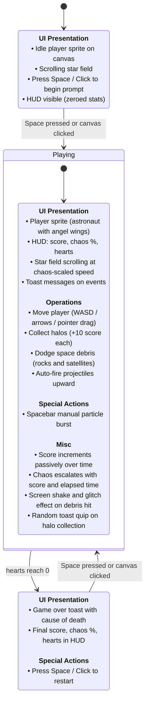

```mermaid
stateDiagram-v2
    [*] --> Title

    Title: **UI Presentation**<br/>• Idle player sprite on canvas<br/>• Scrolling star field<br/>• Press Space / Click to begin prompt<br/>• HUD visible (zeroed stats)

    state Playing {
        [*] --> Active

        Active: **UI Presentation**<br/>• Player sprite (astronaut with angel wings)<br/>• HUD: score, chaos %, hearts<br/>• Star field scrolling at chaos-scaled speed<br/>• Toast messages on events<br/><br/>**Operations**<br/>• Move player (WASD / arrows / pointer drag)<br/>• Collect halos (+10 score each)<br/>• Dodge space debris (rocks and satellites)<br/>• Auto-fire projectiles upward<br/><br/>**Special Actions**<br/>• Spacebar manual particle burst<br/><br/>**Misc**<br/>• Score increments passively over time<br/>• Chaos escalates with score and elapsed time<br/>• Screen shake and glitch effect on debris hit<br/>• Random toast quip on halo collection
    }

    GameOver: **UI Presentation**<br/>• Game over toast with cause of death<br/>• Final score, chaos %, hearts in HUD<br/><br/>**Special Actions**<br/>• Press Space / Click to restart

    Title --> Playing : Space pressed or canvas clicked
    Playing --> GameOver : hearts reach 0
    GameOver --> Playing : Space pressed or canvas clicked
```
