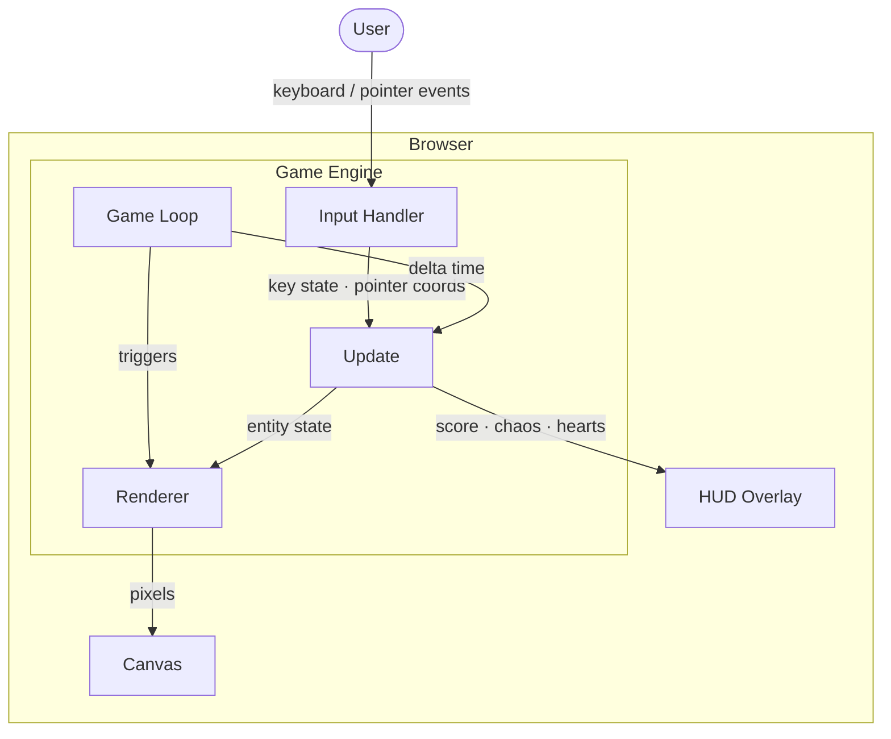

```mermaid
flowchart TD
    User(["User"])

    subgraph Client ["Browser"]
        subgraph Engine ["Game Engine"]
            Loop["Game Loop"]
            Input["Input Handler"]
            Update["Update"]
            Draw["Renderer"]
        end
        HUD["HUD Overlay"]
        Canvas["Canvas"]
    end

    User -->|"keyboard / pointer events"| Input
    Input -->|"key state · pointer coords"| Update
    Loop -->|"delta time"| Update
    Loop -->|"triggers"| Draw
    Update -->|"entity state"| Draw
    Update -->|"score · chaos · hearts"| HUD
    Draw -->|"pixels"| Canvas
```
